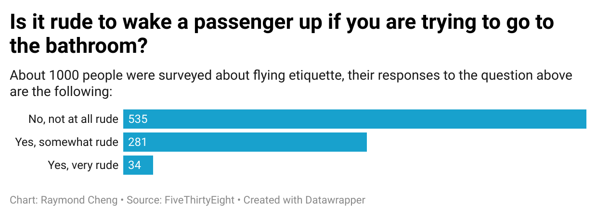

My question is the following: "Is it rude to wake a passenger up if you are trying to go to the bathroom?" I picked this question because it is a question that I feel like I would have if I was in a situation where I am sitting in a seat not next to an aisle and I need to use the bathroom. I am the type of person to not want to bother others, especially if they're sleeping. I found this dataset interesting because it seems to show that my worries are excessive and that I am overthinking the situation. My chart reveals that most people do not find waking them up to allow another person to use the bathroom rude at all.

About 1000 people were surveyed about flying etiquette in this dataset. Here is a chart visualizing their responses to the above question.

